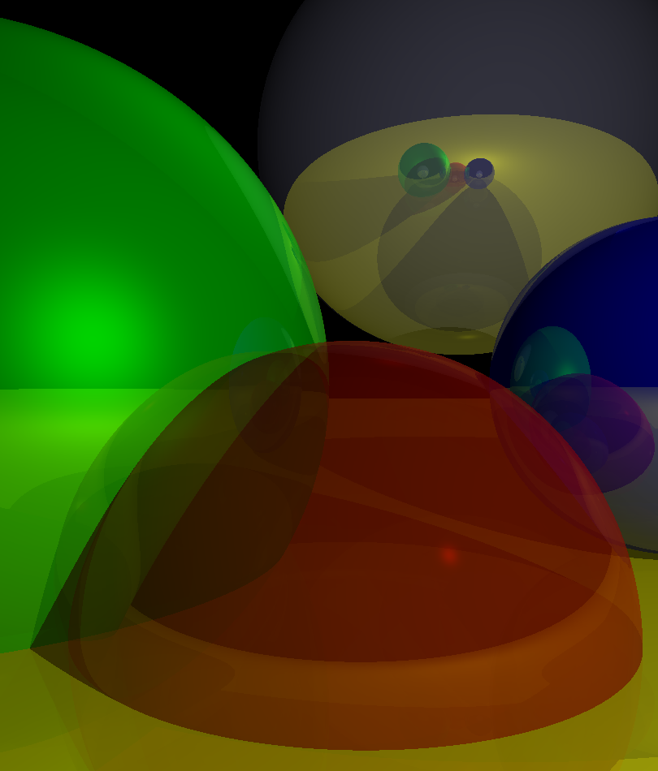

# raytracer

Just for fun: a simple raytracer, written by following the excellent
[tutorial](https://www.gabrielgambetta.com/computer-graphics-from-scratch/raytracing.html)
by Gabriel Gambetta, with some extensions.

## Features

- Read a scene from a file, output it to a `.png` file
  - The picture above was generated by [`scene.hjson`](scene.hjson)
- Spheres (no other shapes currently supported)
- Ambient, diffuse, and specular lighting
- Shadows
- Transparency
- Reflections
- Refractions
- Multithreading
